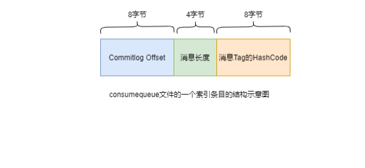
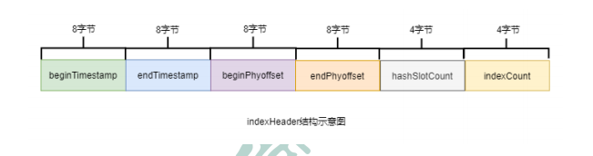
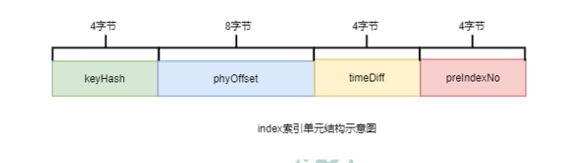

# RocketMQ 思考

## 读写队列数量分别作用

只是设置队列的权限，便于队列的扩缩容，比如扩容，就可以先禁写，等待消费完毕在扩容后开启写入

## RocketMQ Slave 作用

在 RocketMQ 中，从节点似乎并不是用于故障转移的，而是用于数据可靠性的，是主备模型，而同时也可以分担读压力。主从架构下，**主从并不会切换**，需要额外引入故障转移组件如 controller 和 Dledger。如果主节点宕机了，并发消费的时候，是可以从 slave 中读取消息进行消费的，但是顺序则不行。

## 配置

### 1. 控制 jvm 参数

启动命令中会使用环境变量中的 JAVA_OPT_EXT，因此我们可以指定环境变量来控制 jvm 相关参数

## 存储

### commitLog

在 rocketmq 中被称为 mappedFile，每个 mappedFile 最大是 1G，文件名称为第一条消息的 offset，整个文件由一条条的消息单元(消息总长度 MsgLen、消息的物理位置 physicalOffset、消息体内容 Body、消息体长度 BodyLength、消息主题 Topic、Topic 长度 TopicLength、消息生产者 BornHost、消息发送时间戳 BornTimestamp、消息所在的队列 QueueId、消息在 Queue 中存储的偏移量 QueueOffset 等近 20 余项消息相关属性)组成，当 mappedFile 写不下消息时会创建新的 mappedFile，而可能由于不同的消费者读取的消息在不同的 mappedFile，通过 mmap 可以很方便快速地读取文件指定内容并缓存到内存中。

### consumeQueue

用于存储 topic 各个队列指定 offset 的物理位置，从而方便消息的读取

这里消息 Tag 的 HashCode 是为了便于 tag 的匹配,tag 支持单个或多个 tag 以及\*,因此支持通过 hashcode 进行匹配减少从 commitlog 中捞消息的消耗。

### indexFile

#### 组成

indexFile 由以下三部分组成:

其中 header 用于描述整个 indexFile 的元信息，包括如下内容:

而 indexFile 中 slot 与 indexes 则是 hash 桶与拉链的关系，index 根据 key 的 hash % 500w 将自己记录到 slots(只有最新的才记录，其他的拉链)中，每个 index(即索引条目)都有一个指针指向上一个 index。

- keyHash：消息中指定的业务 key 的 hash 值
- phyOffset：当前 key 对应的消息在 commitlog 中的偏移量 commitlog offset
- timeDiff：当前 key 对应消息的存储时间与当前 indexFile 创建时间的时间差
- preIndexNo：当前 slot 下当前 index 索引单元的前一个 index 索引单元的 indexNo

#### indexFile 的创建时机:

- 当第一条带 key 的消息发送来后，系统发现没有 indexFile，此时会创建第一个 indexFile 文件
- 当一个 indexFile 中挂载的 index 索引单元数量超出 2000w 个时，会创建新的 indexFile。当带 key 的消息发送到来后，系统会找到最新的 indexFile，并从其 indexHeader 的最后 4 字节中读取到 indexCount。若 indexCount >= 2000w 时，会创建新的 indexFile。
  > > 由次此可以推算出，一个 indexFile 的最大大小是：(40 + 500w _ 4 + 2000w _ 20)字节
  > > 而由此可见一个 indexFile 文件中间会空出 2000w 字节(约等于 19M)的空间作为 slots hash 桶。

## 机制

### 消息写入

一条消息进入到 Broker 后经历了以下几个过程才最终被持久化。

- Broker 根据 queueId，获取到该消息对应索引条目要在 consumequeue 目录中的写入偏移量，即 QueueOffset
- 将 queueId、queueOffset 等数据，与消息一起封装为消息单元
- 将消息单元写入到 commitlog
- 同时，形成消息索引条目
- 将消息索引条目分发到相应的 consumequeue

### 消息拉取

当 Consumer 来拉取消息时会经历以下几个步骤：

- Consumer 获取到其要消费消息所在 Queue 的消费偏移量 offset，计算出其要消费消息的消息 offset

- 消费 offset 即消费进度，consumer 对某个 Queue 的消费 offset，即消费到了该 Queue 的第几条消息
  消息 offset = 消费 offset + 1

- Consumer 向 Broker 发送拉取请求，其中会包含其要拉取消息的 Queue、消息 offset 及消息 Tag。

- Broker 计算在该 consumequeue 中的 queueOffset。

- queueOffset = 消息 offset \* 20 字节

- 从该 queueOffset 处开始向后查找第一个指定 Tag 的索引条目。

- 解析该索引条目的前 8 个字节，即可定位到该消息在 commitlog 中的 commitlog offset

- 从对应 commitlog offset 中读取消息单元，并发送给 Consumer

## 消费

### 位点记录

对于集群模式的消费者组，位点是记录在 broker 的，同时可以在一批消息被消费后选择同步提交还是异步提交，如果是同步，则会等待记录响应后拉取下一批消息然后进行消费。而如果是异步提交则在 rebalance 的时候导致消息的**重复消费**。

同步提交：消费者在消费完一批消息后会向 broker 提交这些消息的 offset，然后等待 broker 的成功响应。若在等待超时之前收到了成功响应，则继续读取下一批消息进行消费（从 ACK 中获取 nextBeginOffset）。若没有收到响应，则会重新提交，直到获取到响应。而在这个等待过程中，消费者是阻塞的。其严重影响了消费者的吞吐量。

异步提交：消费者在消费完一批消息后向 broker 提交 offset，但无需等待 Broker 的成功响应，可以继续读取并消费下一批消息。这种方式增加了消费者的吞吐量。但需要注意，broker 在收到提交的 offset 后，还是会向消费者进行响应的。可能还没有收到 ACK，此时 Consumer 会从 Broker 中直接获取 nextBeginOffset。

### pull 和 push 模型

push 是基于长连接实现的，由客户端发起请求，并设置比较高的超时时间，broker 如果由消息可消费就能够回复客户端从而实现 push 模型，而 pull 则是客户端主动轮询 broker 获取消息。

#### 优缺点对比

push 模型会一直占用资源，但是实时性很好。而 pull 模型则人为控制拉取频率和数量，如果拉取频率过高，同样会导致资源浪费，而拉取频率过低则会导致消费性能下降。

### MappedFile清理
默认在凌晨4点(可配置)删除修改超过72小时(可配置)的mappedFile。同时还会进行consumeQueue和indexFile的清理

## 不同类型的消息
### 延时消息
消息根据延时等级被丢进`SCHEDULE_TOPIC_XXXX`topic对应延时等级的queue中，同时broker会为每个queue创建TimerTask定时查看第一条消息是否到期，如果到期则将其投入正常的topic中。

### 事务消息
通过XA实现的分布式事务，能够发送半消息，然后提交或者回滚事务。当提交或回滚的时候，会将前面的消息一起消费，而不相关的消息会重投回事务topic中

### 顺序消息
对于顺序消息，如果只是单纯的使用自定义selector取模，那么必定会导致在broker宕机的情况下，消息被路由到其他的broker，从而导致前面的消息还没消费，后面的消息已经被其他consumer消费了。

因此要在创建topic的时候加上-o(--order)表示完全顺序，即使broker宕机也要发送到该broker，牺牲可用性来保证一致性。