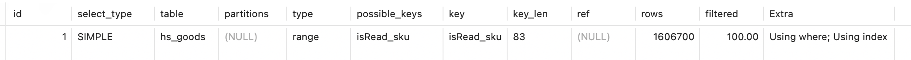
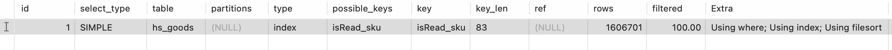

# 低区分度字段做联合索引前缀
## 什么是低区分度？
就是字段的值比较少，且该字段有大量重复的值，如性别字段、状态字段
## 实验
```
CREATE TABLE `hs_goods` (
  `id` int AUTO_INCREMENT,
  `sku` varchar(20) NOT NULL,
  `isRead` int NOT NULL,
  PRIMARY KEY (`id`),
  UNIQUE KEY isRead_SKU(`isRead`, `sku`)
) ENGINE=InnoDB DEFAULT CHARSET=utf8mb4;
```

### 删除isRead=1的数据，limit和全表对比
- `explain DELETE FROM hs_goods WHERE isRead =1 limit 1000`

根据图可以看出来，使用了联合索引，长度为1，即使用了isRead字段
- `explain DELETE FROM hs_goods WHERE isRead =1`

没有使用索引，因为是删除，就会进行全表扫描，然后主键从头锁到尾加next-key-lock(注意，加锁是一个动态的过程，每个索引记录都是一把锁，比如id为1的索引是一把锁，id为2的也是一把锁,mysql在一步步的加锁，包括间隙锁也是如此).

这样就可能导致问题，可能其他更新操作是使用其他索引，那就会先锁二级索引，然后以二级索引映射到主键索引的顺序去锁主键，一般这样得到的主键序列是无序的，例如5 3 6 1这样，那么当全表扫描加锁加到4等待5的锁，而其他操作加锁了5等待3的锁，就产生了循环等待，就会死锁。

### select对于低区分度的字段使用in所有的取值是否有效？
- `explain select * from hs_goods where isRead in ('1','0') and sku > '100001' limit 1000`

我们惊讶的发现居然可以走索引，但是如果你实际去执行，你就会发现和你需要的不对，因为sku并不是顺序的，他会从isRead第一个匹配的去取，比如isRead=0，然后一直取到isRead=0符合条件的没有了，再去找isRead=1符合条件的。

- `explain select * from hs_goods where isRead in ('1','0') and sku > '100001' order by sku asc limit 1000
`

我们对sku进行排序，发现其有using filesort，同时rows几乎为整个表的数据量，因此其会进行排序，这样性能很不好，当需要忽略isRead时并不能起作用

## 为什么要用低区分度字段做联合索引？
- 低区分度字段常常出现在查询中，通过将低区分度字段加在前缀中，能更好的利用索引过滤数据，减少结果集规模。**但是如果没有这个前缀，对于后面字段的范围查询和排序都能够正常使用**
- 我认为是需要保证加锁的顺序，比如对于状态字段不在索引中，删除条件为delete from test where status = -1,那么就会全表扫描，主键索引从头锁到尾next-key-lock.但是如果存在(status, xxx)索引，那么就可以保证delete先锁联合索引，再锁主键。当然这里delete需要加上limit限制，否则mysql会认为全表扫描性能相对更优(因为status过滤不了多少数据，然后查到数据之后需要回表)

## 为什么低区分度字段排在前面？
我们假设低区分度字段在大多数查询更新中都会作为where条件，因此只要使用到该字段都可能使用索引。但因此引入了排序问题，比如(status, sku)索引，现在只有对status和sku是有序的，如果是status是单个值的话，sku是有序的，但是如果status是多个值，比如status in (0,1)那么就不会有序了，因此若需要按sku排序就会需要using filesort。

当然我们可以自己通过union的方式去查询，这样我们只需要查**limit数量 * status枚举数量**的记录数，然后在临时表中进行排序。但是这似乎不是很方便，而且对于delete、update写子查询并不方便也不会锁索引。

总结，如果低区分度字段写在后面，大多数情况下都不会用到低区分度字段，因为要满足前缀匹配原则。

## 关于limit对索引选择的影响
对于条件区分度低的查询，如数据量无法过滤30%，那么mysql可能会更愿意全表查询。而当我们采用limit之后，假设有100w数据，通过低区分度字段获得了50w数据，但是只需要沿着低区分度字段的索引limit指定条就可以了，因此查询成本大大降低，所以会采用索引。

## 总结
对于低区分度的字段索引，一般的使用应该限于低区分度等值查询，这样后面的其他索引字段就像没有该低区分度字段一样能够应用。如按后续字段排序、范围查询等。


